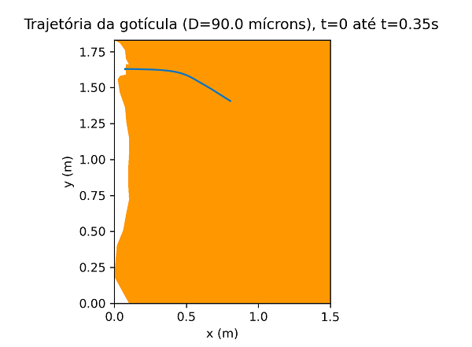

<h1> Projeto Final </h1>

Projeto de Graduação do Curso de Engenharia Mecânica na Universidade Federal do Rio de Janeiro (UFRJ).

<h1>Sobre</h1>

Aplicação da Dinâmica de Fluidos Computacional na avaliação do deslocamento de gotículas no contexto da pandemia de COVID-19.
 

<h1>Tecnologias utilizadas</h1>
<ul>
    <li><a href="https://www.python.org/">Python</a></li>
    <li><a href="https://gmsh.info/">Gmsh</a></li>
</ul>

<h1>Demonstração</h1>
<h2>Malha construída no Gmsh</h2>

<h2>Resultado obtido para uma das geometrias utilizadas</h2>

<h1>Projeto de Graduação em PDF</h1>

Link oriundo do Repositório da Escola Politécnica da UFRJ:
 
<ul>
    <li><a href = "http://www.repositorio.poli.ufrj.br/rep-download.php?farquivo=projpoli10034318.pdf&fcodigo=5238">APLICAÇÃO DA DINÂMICA DE FLUIDOS COMPUTACIONAL NA AVALIAÇÃO DO DESLOCAMENTO DE GOTÍCULAS NO CONTEXTO DA PANDEMIA DE COVID-19</a></li>
</ul>
